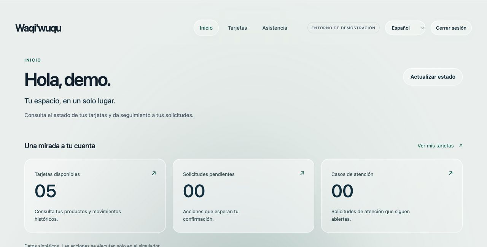
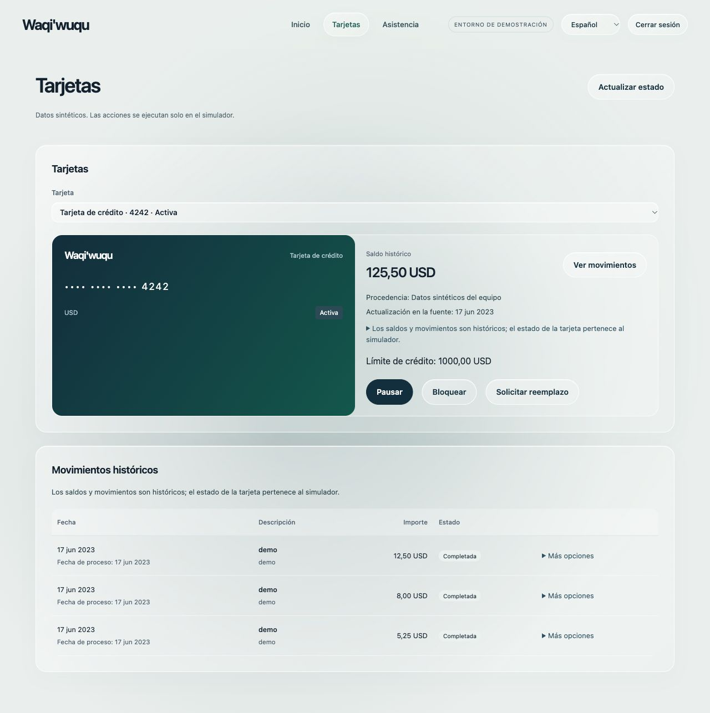
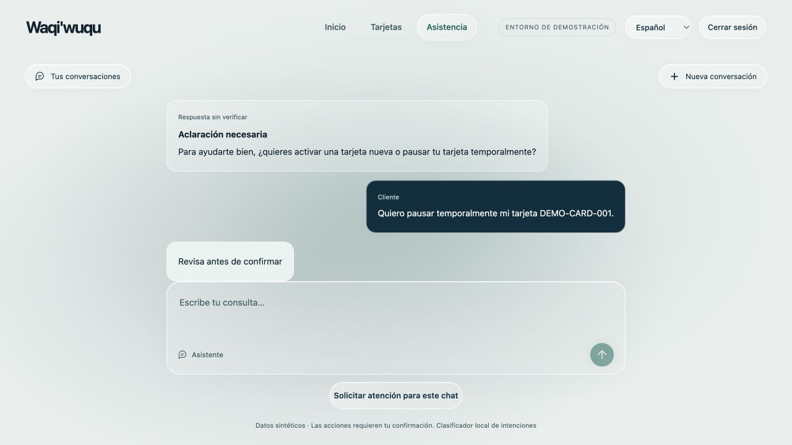
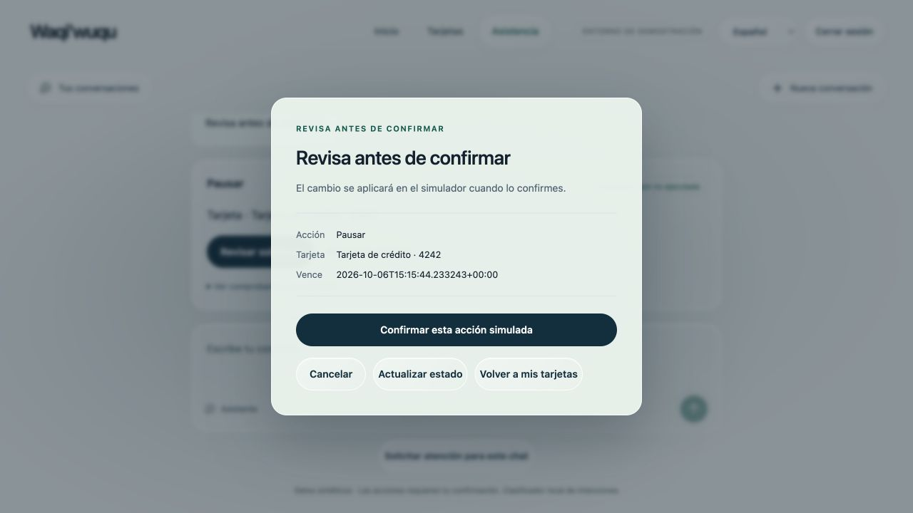
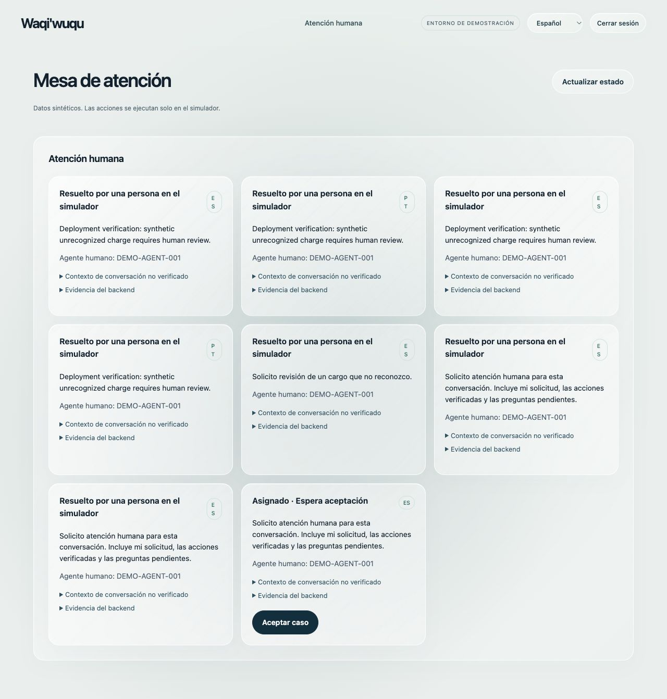
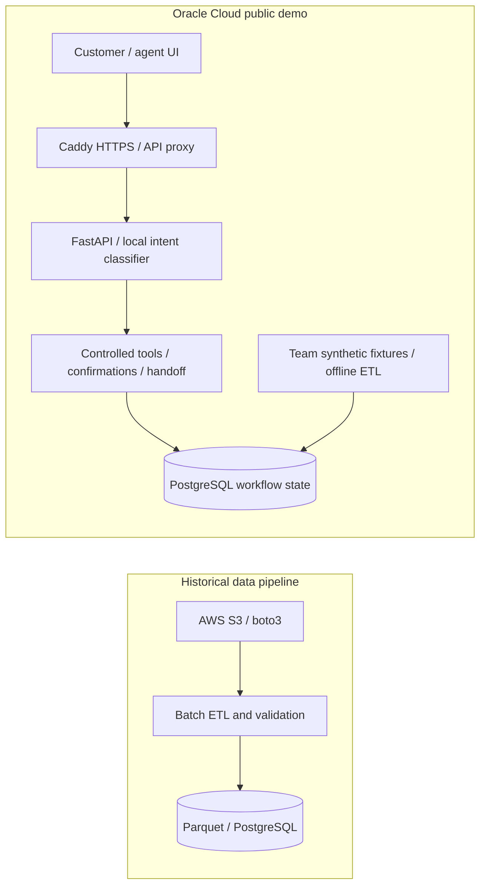

# Banking Support ML System

**Bilingual intent classification connected to validated data pipelines, controlled FastAPI workflows, persistent state, human escalation, and system-level evaluation.**

Customers get card support in Spanish and Portuguese: consult cards, request simulated actions, and continue with a human agent when needed. Built by the Waqi’wuqu team for the Factored AI & Data Hackathon 2026; this case study highlights [Andrew’s](https://github.com/A625A) work in **evaluation, data quality, and reliable model-to-backend integration**.

## Live Demo

**[Open the application](https://factored-ai.163-192-145-116.sslip.io/)** · **[Watch the demo video](https://youtube.com/watch?v=WtR6R8uWQwY&feature=youtu.be)**

### Public Demo Credentials

| Role | Username | Password |
| --- | --- | --- |
| Customer | `demo` | `Mp3DT6H9ZuF8Q41H2ldF5MSUJ1VrJPPWmjtNmDOD-wY` |
| Human Agent | `demo-agent` | `oqR3IQku_Mv7EpJ465KSbNHA8zR9orWyW4lFmCjdVto` |

These credentials provide access only to the synthetic public hackathon demo. No real banking or customer data is used.

## Key Engineering Highlights

Capabilities of the **team system**, with my contributions detailed below:

- **Data engineering:** Python, AWS S3 + boto3, and batch ETL over **6.1M+ historical records across nine banking tables**, with validated Parquet releases, DuckDB/SQL profiling, and PostgreSQL publication.
- **ML integration:** scikit-learn **character TF-IDF + logistic regression** for ten intents, packaged as JSON weights for local inference inside FastAPI.
- **Reliable workflows:** persistent conversations, idempotency, controlled tool execution, explicit server-side confirmations, and human handoff.
- **Deployment and operations:** **Oracle Cloud**, Docker/Compose, Caddy HTTPS/TLS, health/readiness checks, and bounded operational metrics.
- **System evaluation:** **60 frozen synthetic ES/PT scenarios**, with outcomes checked against persisted backend evidence.

AWS S3 supports historical data ingestion; **Oracle Cloud hosts the public application**. [Technical evidence](docs/evidence.md)

## Demo

Real screenshots from the public synthetic demo. **Customer workspace → Spanish ML-assisted support → explicit confirmation → human fallback.** Select an image to view it at full resolution.

<table>
  <tr>
    <td width="50%" align="center">
       
      <strong>Customer workspace</strong> 
      Cards, pending confirmations, and support cases in one authenticated view.
    </td>
    <td width="50%" align="center">
       
      <strong>Card context</strong> 
      Synthetic card details and historical movements, with source provenance visible.
    </td>
  </tr>
  <tr>
    <td align="center">
       
      <strong>ML-assisted support</strong> 
      A real Spanish interaction: clarification, a specific card request, and review before confirmation.
    </td>
    <td align="center">
       
      <strong>Controlled action</strong> 
      The customer reviews the action and target card before execution. This request was cancelled.
    </td>
  </tr>
  <tr>
    <td colspan="2" align="center">
       
      <strong>Human escalation</strong> 
      The same conversation reaches the agent workspace, assigned and awaiting acceptance.
    </td>
  </tr>
</table>

## My Contributions

This was a team project. My work focused on system evaluation, data quality, and reliable model-to-backend integration.

- **System-level bilingual evaluation.** Built a reproducible Python evaluator with frozen references and separate classifier, API, and controlled-seam lanes. It exposed integration failures by checking backend outcomes rather than response text. [Implementation](https://github.com/yehosuah/FactoredAI_base/commit/f716fc734e920fe4d5cd760f39a28c83663683ef) · [PR #9](https://github.com/yehosuah/FactoredAI_base/pull/9)
- **Data quality and modeling suitability.** Built an aggregate-only DuckDB/SQL profiler for Parquet releases, checking reconciliation, ownership-aware joins, repeated text, and temporal anomalies to assess whether data was suitable for downstream use. [Commit](https://github.com/yehosuah/FactoredAI_base/commit/12073d8efe05367948447254937ad3b79be0e9d2)
- **Persistent model-to-backend integration.** Implemented PostgreSQL-backed conversations, ordered events, idempotent turns, and an injected adapter contract with a test stub, providing the backend interface for later classifier integration. [Commit](https://github.com/yehosuah/FactoredAI_BCK/commit/9ad187f73a8b642622e3c8ce55d78d0e6610f089)
- **Controlled execution and confirmation.** Built the tool dispatcher and server-owned confirmation flow, with authorization, ownership, and state rechecks before simulated actions. Model proposals cannot authorize execution. [Dispatcher](https://github.com/yehosuah/FactoredAI_BCK/commit/8328d74e5b523529842b098cf8248bb4cfe7e41c) · [Confirmation](https://github.com/yehosuah/FactoredAI_BCK/commit/142608b51706ca2637e3e8ba815379ed21d3c9e6)
- **Human escalation and recovery.** Implemented persistent handoff routing and audited recovery so unresolved requests can continue through an accountable human workflow. [Handoff](https://github.com/yehosuah/FactoredAI_BCK/commit/fd40d2cb5a4fe6142aae776a3742f57ae8eebf9f) · [Recovery](https://github.com/yehosuah/FactoredAI_BCK/commit/033dccbe4ef84f447f093755908a14a87e14bf11)
- **Operational visibility.** Added bounded HTTP request, error, and latency aggregates plus authenticated operational reporting to support diagnosis of backend behavior. [Commit](https://github.com/yehosuah/FactoredAI_BCK/commit/bd2e74a929aa9445fd9368f80262c4d5bb3db4d9)

The original S3 ingestion/core ETL, classifier training and packaging, frontend, and public deployment are **team work**. [Full contribution ledger](docs/contributions.md)

## Architecture

The demo uses its own synthetic fixtures. The backend validates model proposals and owns execution; PostgreSQL preserves conversations, confirmations, actions, and handoffs. [Architecture and boundaries](docs/architecture.md)

## Data & AWS Pipeline

The team’s historical pipeline combines paginated S3 acquisition, bounded retries, integrity checks, source manifests, and batch validation. Its nine-table release reconciles **6,114,029 input records = 6,020,768 accepted + 93,261 quarantined**. These are data-processing volumes; the classifier uses a separate team-authored synthetic corpus.

My profiler adds aggregate checks for data quality and modeling suitability. I also hardened optional ML inputs so omission is supported while explicitly invalid inputs fail. [Reconciliation evidence](https://github.com/yehosuah/FactoredAI_base/blob/c222173ee03df46be914cbfacfb097823f6a7196/docs/design/etl-system/verification.md) · [Input contract](https://github.com/yehosuah/FactoredAI_base/commit/28d4b851a1de2ea1ab90c48827aefce8731e65db)

## ML System Integration

The learned classifier predicts intent; deterministic policy maps that prediction into a typed proposal for an answer, clarification, tool request, or human handoff. Exported vocabulary, IDF values, and coefficients enable local inference without a runtime scikit-learn dependency. Responses use ES/PT templates.

My adapter contract connects this model layer to authenticated, persistent workflows. Authorization, eligibility, explicit confirmation, and action receipts remain backend responsibilities. [Model and integration details](docs/architecture.md#model-boundary)

## Deployment & Production Engineering

**Team delivery:** a public application on Oracle Cloud with Docker Compose, FastAPI, PostgreSQL, and a Caddy HTTPS/TLS edge. The edge serves the frontend and proxies API requests; the backend binds to host loopback, and PostgreSQL stays on an internal Docker network. Persistent volumes, separate runtime secret files, locked dependencies, and health/readiness endpoints support operation.

The public demo was validated against later backend/frontend candidate revisions than the consolidated submission snapshot. Exact provenance and deployment verification are documented in [docs/deployment.md](docs/deployment.md).

## Monitoring & Evaluation

Operational visibility combines health/readiness, bounded process-local HTTP metrics, and persisted action reporting. The operational metrics route is authenticated and blocked at the public proxy.

My evaluator checks **60 frozen synthetic scenarios: 30 Spanish and 30 Portuguese**, across classifier conversations, direct API probes, and controlled seams. Safe outcome checks rely on persisted backend evidence. My original run matched **44/60**, exposed integration failures, and became the basis for the **later team regression of 60/60**. That regression is not classifier accuracy, an untouched holdout, or proof of production safety. [Results and provenance](docs/evidence.md#evaluation)

## Scalability & System Design

Separate components and explicit contracts support independent development. PostgreSQL persistence and idempotency preserve workflow state across retries; bounded acquisition retries, incremental object downloads, and reusable releases limit repeated work. Dockerized services, human fallback, and health/readiness provide practical operational boundaries.

The deployment is a single VM; capacity and high availability have not been established. [Scaling mechanisms, locks, and constraints](docs/architecture.md#scalability--system-design)

## Tech Stack

Technologies across the **team system**:

- **Machine Learning:** Python · scikit-learn · TF-IDF · Logistic Regression · system evaluation
- **Data Engineering:** AWS S3 · boto3 · SQL · DuckDB · PostgreSQL · Parquet
- **Backend / Systems:** FastAPI · REST APIs · authentication · idempotency · controlled execution
- **Infrastructure:** Docker · Docker Compose · Oracle Cloud · Caddy · HTTPS/TLS
- **Reliability / MLOps practices:** health/readiness · operational metrics · persistence · model packaging · regression evaluation · human fallback

## Original Team Repositories

- [ETL / Data / Evaluation — FactoredAI_base](https://github.com/yehosuah/FactoredAI_base)
- [Backend — FactoredAI_BCK](https://github.com/yehosuah/FactoredAI_BCK)
- [Final hackathon repository — Waqi’wuqu](https://github.com/yehosuah/factored-hackathon-2026-waqi-wuqu)

This portfolio documents my contributions to a collaborative project. Original implementation and team history remain in the repositories above.

## Limitations / Scope

A publicly hosted synthetic prototype with simulated banking actions. Real-customer generalization, production capacity, drift monitoring, and automated retraining are outside the demonstrated scope. [Evaluation details](docs/evidence.md)

## Portfolio Disclaimer

This repository is a technical case study; it does not redistribute application code or datasets. For runtime commands, use the [team setup guide](https://github.com/yehosuah/factored-hackathon-2026-waqi-wuqu/blob/24395b49addb8bb1dc47b9fff5e935730fb442c8/docs/setup.md) alongside the [deployment revision notes](docs/deployment.md#source-snapshot-versus-deployed-revision).
