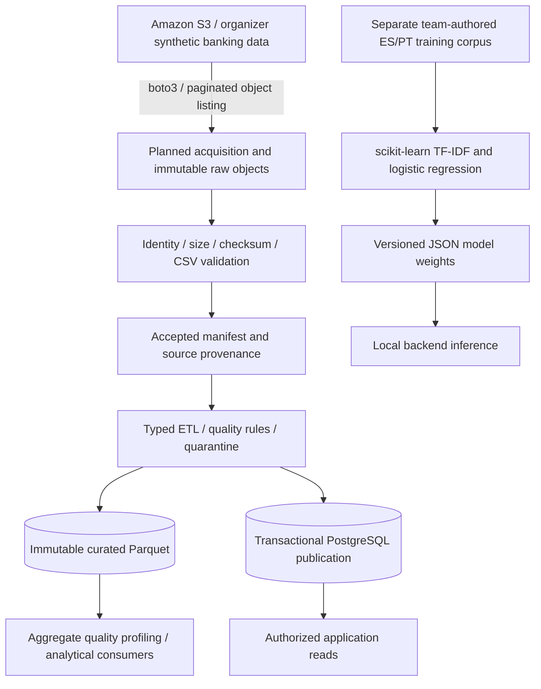
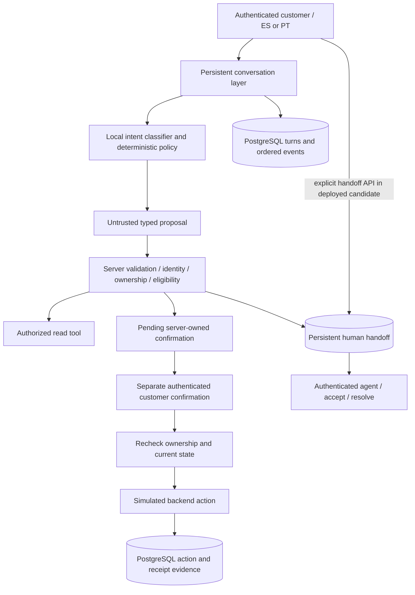
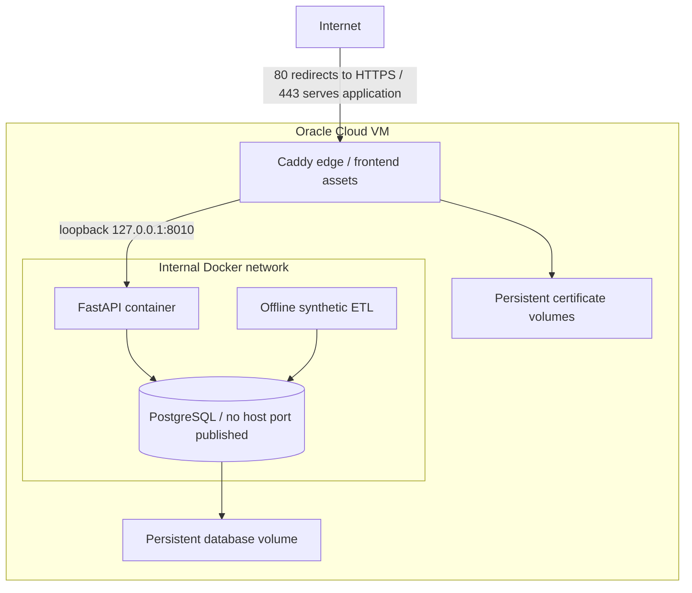

# Architecture and System Design

The system separates data acquisition, curation, backend authority, learned intent routing, and frontend interaction. Independent source repositories and explicit interfaces support component evolution; the deployed classifier still runs **inside the backend process**, not as a separate inference service.

## Data Engineering Boundary: AWS S3

S3 is a **data source**, not application hosting. The public demo separately bootstraps team-generated fixtures with offline ETL; it does not expose organizer records or require AWS credentials.

The [`S3Source` implementation](https://github.com/yehosuah/FactoredAI_base/blob/c222173ee03df46be914cbfacfb097823f6a7196/src/factored_bank/extract/source.py) uses:

- `list_objects_v2` continuation tokens, rejecting missing/repeated pagination tokens;
- up to three application attempts for eligible transient failures, jittered backoff, and explicit connection/read timeouts;
- planned object size, ETag and modification-time checks, conditional object reads, SHA-256 and supported full-object checksum validation;
- manifest-backed provenance and fail-closed handling of changed sources, invalid structure or incomplete acquisitions.

ETags are object identity evidence; they are not assumed to be universal content hashes. Unsupported remote checksum formats remain explicitly labeled. Historical acceptance records **5,489 objects and 6,114,029 logical records**; repeated acquisition reused verified bytes without new downloads. [Acquisition evidence](https://github.com/yehosuah/FactoredAI_base/blob/c222173ee03df46be914cbfacfb097823f6a7196/docs/design/extract-card-support/verification-v1.md)

Incremental acquisition avoids unnecessary object transfer. Transform also caches a prepared release using raw-release, contract, code, lockfile and optional-ML identities. A cache miss still prepares a complete release: this is **not evidence of a streaming or row-incremental transformation engine**. Parquet releases remain immutable and database publication switches an accepted release transactionally. [Transform](https://github.com/yehosuah/FactoredAI_base/blob/c222173ee03df46be914cbfacfb097823f6a7196/src/factored_bank/etl/transform.py)

## Application and Authority Boundary

A generated answer, classifier confidence, queued handoff, or prepared confirmation does not prove successful execution. Model output cannot grant authorization or confirm its own proposed mutation. Idempotency keys bind retries to prior operations; changed input with the same key is rejected.

The conversation adapter receives bounded context and returns a strict proposal. The original interface supplied an engineering stub; the learned adapter was integrated later. Session, conversation, handoff, confirmation and action records live in PostgreSQL. HTTP telemetry and model objects remain process-local. [Conversation contract](https://github.com/yehosuah/FactoredAI_BCK/blob/9ad187f73a8b642622e3c8ce55d78d0e6610f089/docs/conversations.md)

## Model Boundary

The team classifier uses character TF-IDF features and logistic regression for ten banking-support intents, trained on 280 team-authored synthetic examples. Training uses scikit-learn; serving loads exported JSON vocabulary, IDF values and coefficients. The API’s production dependency set does not require scikit-learn. Artifact validation and a numerical parity test support packaging correctness.

The reported grouped cross-validation uses a unique declared family for each training case, so grouping alone does not protect against nearby paraphrases. Hyperparameter and confidence-threshold selection reused evaluation predictions. These are known limitations, not independent evidence of real-customer generalization. See [model implementation in the public snapshot](https://github.com/yehosuah/factored-hackathon-2026-waqi-wuqu/tree/24395b49addb8bb1dc47b9fff5e935730fb442c8/backend/src/factored_bck/intent).

## Scalability & System Design

### Mechanisms actually implemented

| Mechanism | Why it matters | Boundary or constraint |
| --- | --- | --- |
| Separate ETL, backend and frontend components | Releases and contracts can evolve without one monolithic codebase. | Cross-repository version compatibility still needs integration checks; the published snapshot demonstrates this risk. |
| Incremental acquisition and release reuse | Repeated runs avoid downloading unchanged historical objects and can reuse matching prepared outputs. | Full inventories/checks still incur work; changed releases are not guaranteed to transform only changed rows. |
| Immutable data and explicit provenance | Failures can be investigated against identifiable inputs and accepted releases. | This is data reproducibility, not unlimited storage or automatic retention management. |
| PostgreSQL persistence | Requests/reconnects do not depend exclusively on one worker’s memory for workflow state. | The deployed database is a single shared dependency; replication, backups and failover are not established here. |
| Idempotent mutations and bounded retries | Retries can avoid duplicate actions and cannot retry indefinitely. | Provider/tool retries are not universal; the adapter contract initially uses zero automatic provider retries. |
| Docker and dependency locks | Components can be built and run in repeatable environments. | Containers alone do not provide autoscaling, zero-downtime upgrades or high availability. |
| Modular tools and typed model proposals | Model changes cannot implicitly expand the set of authorized actions. | In-process inference is logically isolated, not an independent failure domain. |
| Persistent human fallback | Unsupported, risky or ambiguous requests can enter an auditable human workflow. | Queueing is not resolution; agent capacity and response times are unmeasured. |
| Health/readiness and bounded metrics | Operators can distinguish service availability and inspect request/error/latency aggregates. | HTTP counters are local to each process and reset on restart; no central alerting or metrics backend was verified. |

### Properties that enable future scaling

Durable shared state and idempotent request semantics make backend replication technically plausible. It would still require a deliberate deployment design, shared configuration, database connection/concurrency sizing, compatible migrations, metric aggregation and load testing. No load balancer or replicas were observed in this deployment.

The conversation transaction serializes work per customer with advisory/row locks and invokes the bounded adapter while holding that transaction. This favors consistent ordering but limits parallel requests for the same customer and can hold database resources while inference runs. Moving inference outside a transaction would require preserving authorization, state-version and idempotency guarantees—not simply adding workers.

ETL and frontend can be deployed independently of API changes when contracts remain compatible. A separate inference service, distributed queue, autoscaling policy or database replica would be future work. The verified topology is one Oracle VM with Docker Compose, not a system proven under production-scale load.

## Public Hosting Boundary

This diagram shows application traffic, not a complete host firewall model. SSH and an additional host RPC listener were observed; therefore it does not imply that only ports 80/443 exist on the VM. [Network evidence and limitations](deployment.md#network-boundaries)
