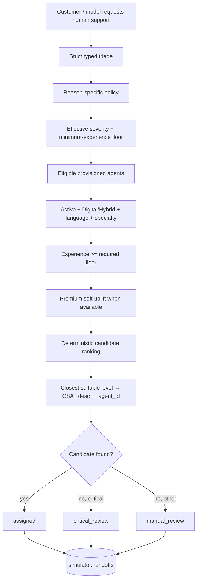
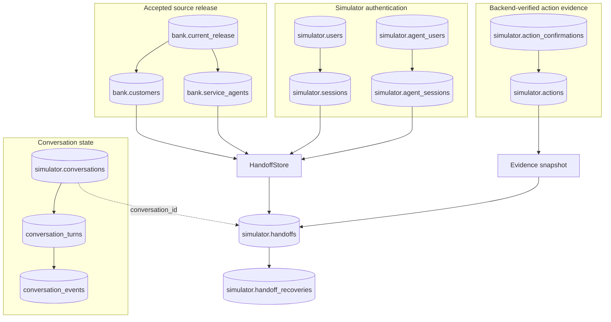
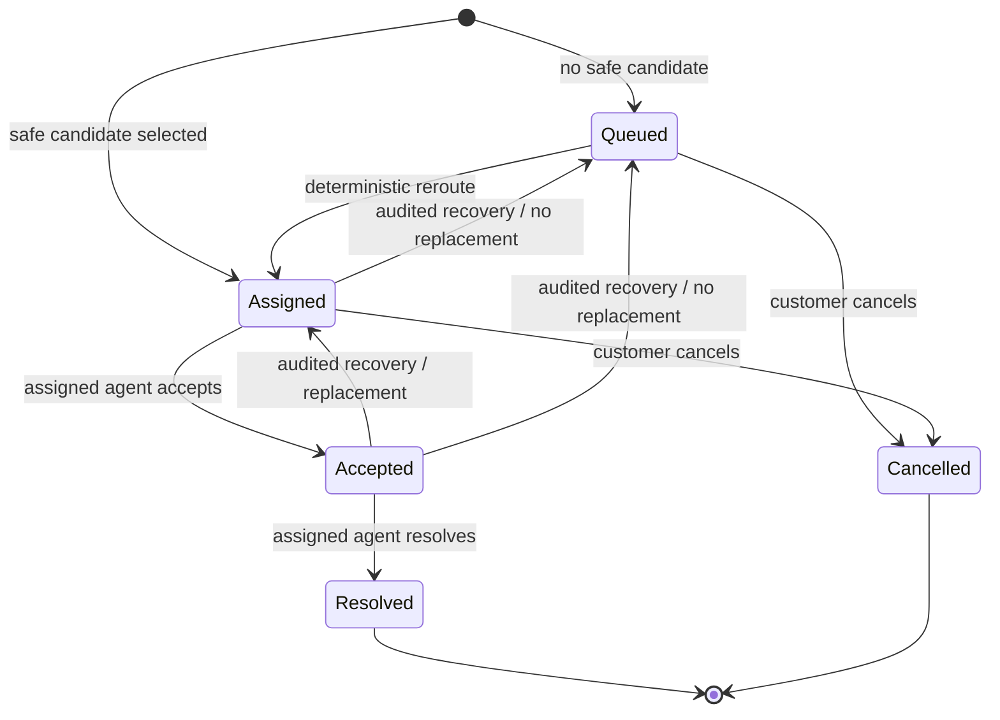

# Human-Agent Routing & Decisioning

This document focuses on one of Andrew's largest personal backend contributions: persistent human handoff with deterministic agent eligibility, ranking, safe fallback, and PostgreSQL lifecycle state.

Primary authored evidence:

- [`fd40d2c` — persistent human handoff routing](https://github.com/yehosuah/FactoredAI_BCK/commit/fd40d2cb5a4fe6142aae776a3742f57ae8eebf9f)
- [`033dccb` — audited handoff recovery](https://github.com/yehosuah/FactoredAI_BCK/commit/033dccbe4ef84f447f093755908a14a87e14bf11)
- [`tests/test_handoff_routing.py`](https://github.com/yehosuah/FactoredAI_BCK/blob/fd40d2cb5a4fe6142aae776a3742f57ae8eebf9f/tests/test_handoff_routing.py)
- [`tests/test_handoffs.py`](https://github.com/yehosuah/FactoredAI_BCK/blob/fd40d2cb5a4fe6142aae776a3742f57ae8eebf9f/tests/test_handoffs.py)
- [`tests/test_handoff_recovery.py`](https://github.com/yehosuah/FactoredAI_BCK/blob/033dccbe4ef84f447f093755908a14a87e14bf11/tests/test_handoff_recovery.py)

## Decision Flow

## What the Ranking Actually Does

The implementation is deterministic policy, not a learned ranking model.

1. **Triage validation.** Reason, severity, specialty, minimum experience, language, summary/context and optional product ID are strict bounded fields. Fraud requires the `Fraudes` specialty and is raised to at least high severity; complaints and technical support also require their matching specialties.
2. **Eligibility.** Candidates must be represented by an enabled provisioned simulator account and an accepted-release agent snapshot with Active status, Digital/Hybrid type, compatible language and matching specialty when required.
3. **Safety floor.** The effective experience floor is the higher of the severity floor and the explicit triage minimum: low/Junior, medium/Mid-Senior, high/Senior, critical/Specialist.
4. **Premium preference.** Premium is a simulated soft preference for one experience level above the floor, capped at Specialist. If that preferred level is unavailable, the safe-floor candidate pool is retained.
5. **Ranking.** The selected safe pool is ordered by closest suitable experience, CSAT descending with null values last, then agent ID for deterministic tie-breaking.
6. **Critical fallback.** Senior can replace Specialist only for explicitly configured reasons and only when the triage minimum itself does not require Specialist.
7. **No unsafe forced match.** If no candidate satisfies policy, the case is persisted unassigned in manual or critical review.

The implementation intentionally does **not** use historical interaction volume as live load, does not claim live presence from the monthly snapshot, and does not implement weighted scoring, a queue scheduler, or a workforce-optimization model.

## Service Priority vs Agent Ranking

- **Agent selection:** closest suitable experience → CSAT descending → agent ID, after all safety/eligibility filters.
- **Case listing:** severity descending → Premium preference within severity → creation time → handoff ID.

This separation prevents a customer-segment preference from lowering safety requirements while still giving the agent workspace a deterministic service-priority order.

## PostgreSQL Persistence Model

A persisted handoff contains the authenticated customer scope, idempotency key, canonical triage payload, accepted release, effective severity/required experience, assigned agent when present, lifecycle status/timestamps, routing metadata, model/customer context marked as untrusted, and a verified-evidence snapshot.

The response surface omits customer/login identity, idempotency payload, password hashes and token hashes. Agent identity is never accepted from the model/customer triage payload.

## Lifecycle

Creation uses a customer-scoped idempotency key and commits the routing decision and evidence in one transaction. Replaying the same key and payload returns the same case. Changed input with the same key conflicts rather than silently creating a second case.

Lifecycle mutations reauthenticate inside their transaction. Row locks and advisory locks serialize competing acceptance/cancellation/recovery operations. Audited recovery is available only through local/database administrative authority, records the previous assignment/routing, and is not exposed as a customer/model tool.

## Why This Matters

The ML layer can decide that a request needs a human, but it does not get to choose an arbitrary customer, agent, queue priority or verified fact. The backend owns those decisions and persists enough evidence to explain what happened later. That makes the handoff a human-in-the-loop **decision system** rather than a simple redirect.

For CV/interview use, the strongest precise framing is:

> Designed a deterministic human-agent routing engine in FastAPI/PostgreSQL using severity-based experience floors, language/specialty constraints, CSAT ranking, idempotent persistence, and safe manual-review fallback.

The system was built for a synthetic hackathon environment. Assignment is not proof of live agent availability, acceptance or real-world case resolution.
